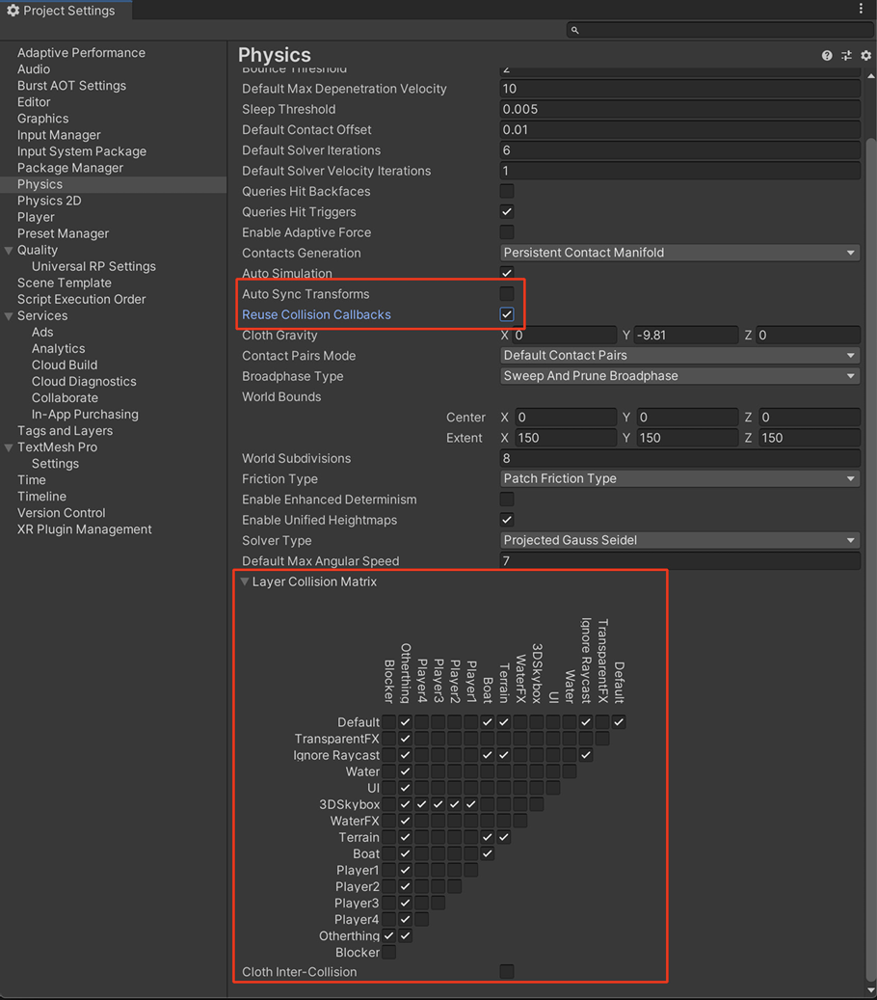
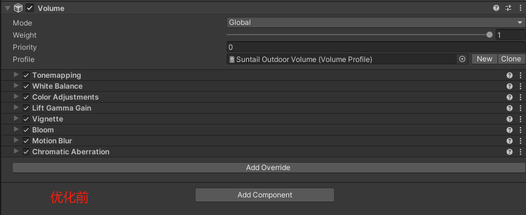

# UnityOptimizedProject
Unity项目性能优化实践

美术资源地址
https://assetstore.unity.com/packages/3d/environments/fantasy/suntail-stylized-fantasy-village-203303

本工程未包含美术资源，仅包含优化建议和性能分析对比图

## 0.项目未优化时的一些参考指标数据

- 生成的Android APK大小  1.23G
- 三角形平均面数 2.0M左右
- 渲染批次 Batches 2200—4000
- SetPass calls  140 —180
- realme GT 骁龙888 8G内存  帧率14-26
  
## 1.项目优化后的一些参考指标数据

- 生成的Android APK大小  418M
- 三角形平均面数 637K左右
- 渲染批次 Batches 1050
- SetPass calls  83
- realme GT 骁龙888 8G内存  帧率30 （由于移动端硬件设置了垂直同步，帧率被锁定为屏幕刷新率的约数（如 60Hz → 60/30/20/15fps））

  
  
  
  

 ## 2.资源检查报告(仅列举音频文件和贴图文件)
 ### 使用UPR(Unity官方资源检测工具)检测项目中的资源
  
  

  ## 3.各模块问题解决
### 1.Audio  
- 根据平台选择合理的音频设置，原始音频资源尽量采用未压缩WAV格式
- 移动平台对音乐音效统一采用单通道设置（Force to Mono）,因为左右声道相同，没必要占用更多内存。但是左右声道不同的音乐不能勾选这个。将音乐采样频率设置为22050Hz，原始文件的为48000Hz,移动端听不出差别，没必要。
- 一般来说应尽可能使用WAV格式这种未压缩的音频格式，然后设置不同平台的压缩比。移动平台大多数声音尽量采用Vorbis压缩设置，IOS平台或不打算循环的声音可以选择MP3格式，对于简短、常用的音效，可以采用解码速度快的ADPCM格式（PCM为未压缩格式），虽然不是压缩最好的，但是解码速度快。
- 简短音效导入后小于200kb，采用Decompress on Load模式
- 对于复杂音效，大小大于200kb，长度超过5秒的音效采用Compressed In Memory模式
- 对于长度较长的音效或背景音乐则采用Streaming模式，虽然会有CPU额外开销，但节省内存并且加载不卡顿
- 当实现静音功能时，不要简单的将音量设置为0，应销毁音频（AudioSource）组件，将音频从内存中卸载。

  

  ### 2.模型导入设置与优化
-尽可能将网格合并到一起，尽可能使用共享材质，非必要不开启网格读写，使用合理的LOD级别，不需要rigs和Blendshapes尽量关闭，如果可能禁用法线或切线
 
 
 
### 3 纹理导入设置检查与优化
- 不同平台，不同硬件配置选择不同的纹理大小，Unity下采用Bundle变体设置多套资源，通过Mipmap限制不同平台加载不同Level层级的贴图
- 美术人员不要通过增加纹理大小的方式增加细节，可以选择细节贴图DetailMap或增加高反差保留的方式
- 如果纹理不是用作颜色信息的话，就不要使用sRGB空间，比如粗糙度贴图，法线贴图等
- 纹理压缩使用ASTC6x6兼顾视觉质量和纹理数据大小
- 使用纹理图集
- 开启MipMaps,如果是2D场景或者固定视角，摄像机无法缩放远近时，不需要开启MipMaps

### 4 动画导入设置检查与优化
  - 人形动画需要Kinematices或Animation Retargeting(动画重定向)，或者有自定义骨骼对象时选择Humanoid。其他都选择Generic,在骨骼数量差不多的情况下，Gengeric会比Humanoid节省30%-50%CPU时间，推荐移动平台使用。
  - Skin Weights: 默认4根骨骼，对于不重要的动画对象可减少到1根，比如足球游戏中看台上的观众
  - Optimize Bones：自动剔除没有蒙皮顶点的骨骼
  - Optimize Game Objects：小件骨骼Transform带来的性能开销。但有时候会造成角色动画错误，视效果而定。如果角色需要换装，导入时不要开启此选项，在代码中调用AnimatorUtility.OptimizeTransformHierarchy仍可以达到此效果。
  - 动画文件大小在小几百K或更少合理，超过1M以上可虑是否合理
   

## 4.Unity中创建资源的优化
  ### 1.场景优化
  - 合理设计场景一级节点的同时，避免场景节点深度太深，一些代码生成的游戏对象如果不需要随父节点进行 Transform的，一律放到根节点下。
  - 尽量使用 Prefab节点构建场景，而不是直接创建的GameObject节点。
  - 避免DontDestroyOnLoad节点下太多生命周期太长或引用资源过多的复杂节点对象。Additive场景尤其要注意。
  - 最好为一些需要经常访问的节点添加 tag，静态节点一定要添加 Static
  - 使用FindGameObjectWithTag让查找更高效
  - 使用嵌套Prefab或者Prefab Variant, 而不是将Prefab duplicate(复制)。

  ### 2.UGUI优化
  - 将所有可能打断合批的层移到最下边的图层，尽量避免UI元素出现重叠区域。
  - 可以拆分使用多个同级或嵌套的Canvas来减少Canvas的Rebatch复杂度。
  - 拆分动态和静态对象放到不同Canvas下。
  - 不使用Layout组件。
  - Canvas的RenderMode尽量使用Overlay模式，减少Camera调用的开销。

  ### 3.Physics 物理优化
  PlayerSettings中的一些必要设置
  - 不勾选Auto Sync Transform，此项的作用是在游戏对象Transform发生变化时立即强制执行一次对物理对象模拟的更新，不勾选等到Fixed Update过程再更新
  - 勾选Resuse Collision Callbacks，简化图层碰撞矩阵
  - 尽可能用基础的Collider代替MeshCollider，如果必须使用，要尽可能保障其是静态物体，勾选Static
  - Kinematic 对象不受物理引擎中力的影响，但可以对其他 RigidBody 施加物理影响。勾选 Kinematic 选项的 RigidBody 对象会被认为是 Kinematic 的，不会增加场景中的 RigidBody 计算负担。场景中的 RigidBody 对象越少越好。
  - Unity 物理系统中的 RayCast 与 Overlap 都有 NoAlloc 版本的函数，在代码中调用时尽量使用 NoAlloc 版本。在调用 RayCast 和 Overlap 时，尽量指定 对象图层 进行过滤，减少不必要的检测，同时 RayCast 还可以指定 最大检测距离，以减少远距离对象的查询开销。如果需要执行 大量的 RayCast 操作，可以使用 RaycastCommand 进行 批量处理，并充分利用 JobSystem 来分摊到多核 CPU 进行多线程计算，从而提高性能。
  
  

  ### 4.动画 优化
- 一些简单、少量曲线动画 可以使用 Animation 或动画区间库（如 Dotween / iTween）完成，例如 UI 动画、Transform 动画 等。
- 角色骨骼蒙皮动画 如果骨骼较少、Animation Clip 资源不多，对动画混合表现要求不高的项目可以采用 Legacy Animation，但需要注意控制 总曲线数量。
- 一些角色动画要求与逻辑有较高的交互，并且动画资源不多的项目 可以直接使用 Animator Graph 完成。
- 一些动作游戏，对动画混合要求较高，或者需要 高级动画效果、动画资源量庞大的项目，建议采用 Animator + Playable API 扩展 Timeline 方式完成。这时动画状态机中只有角色最基础的状态节点，比如走，跑，跳，蹲等基础动作。而一些特殊的比如技能，持不同武器的动画状态模组，以及过场动画的表现都是用Playable API扩展Timeline完成。
- https://www.youtube.com/watch?v=W45-fsnPhJY&t=1968s

## 优化细节
- 将远处的山模型烘焙到一张反射球上，然后在天空盒上使用反射球贴图。
- 使用尽可能少的后处理效果，去掉一些不必要的后处理特性，将Global volume改为Local,天空盒不需要后处理。
  
  

- SSAO如下图所示设置 (将urp包从Library的packagecache拷贝到工程目录下的packages中就可以修改了shader代码了)
  

- 地形比较平坦，关闭投影属性 Cast shadows.
- 删除山脉的灯光，因为此时我们使用的是天空盒，山脉模型已不存在场景中。
- 使用入口剔除，在门上添加Occlusion Portal组件
- 在灯光上挂载Light culling脚本，根据灯光和玩家之间的举例判断是否剔除
- 静态物体勾选Batching Static，建筑，墙壁，大片的不透明物体， Occluder Static(遮挡物)， Occludee Static(被遮挡物)。（由于美术资源的限制，模型缺少2U,故没有烘焙场景灯光）
- 工具，房间内的小物品 ,草，灌木丛，树等，只勾选Occludee.
- 添加移动端操作逻辑（角色移动，交互等）

